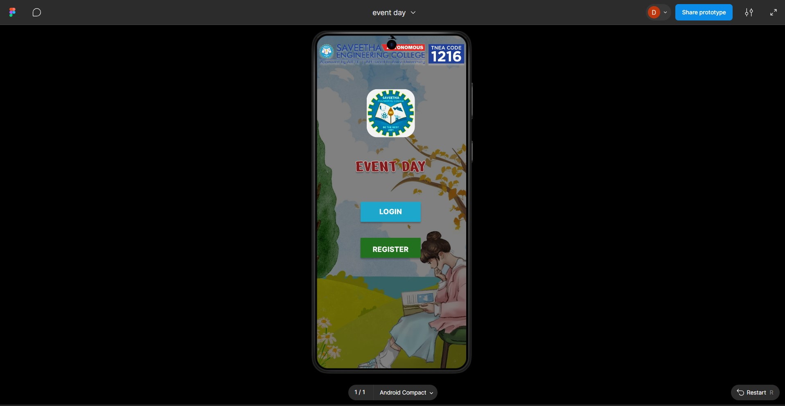
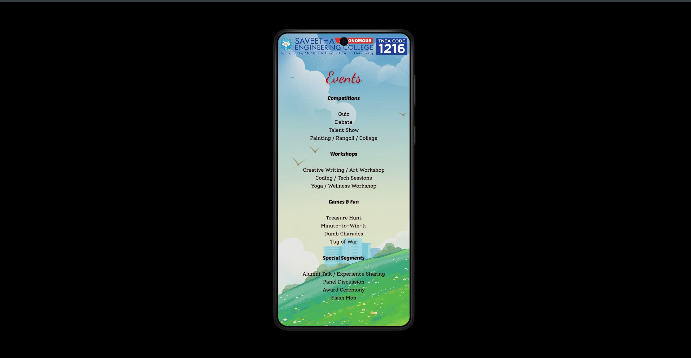
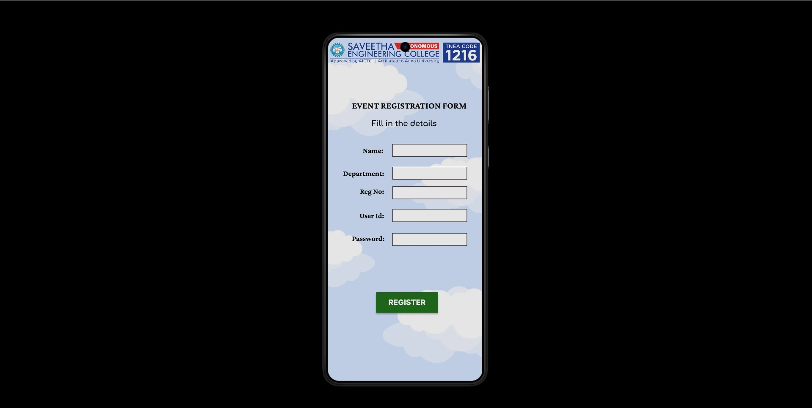
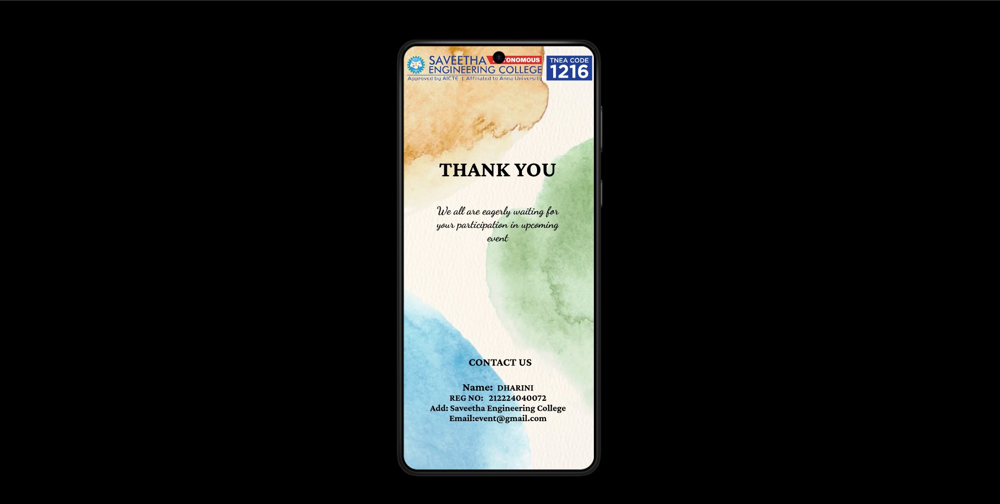

# Ex09 Event Registration Web Application
## Date:

## AIM:
To design, develop and deploy a web application for event registration.

## DESIGN STEPS:

### Step 1:
Create a new frame.

### Step 2:
Select any one preset size of your choice.

### Step 3:
Select the shapes you need.

### Step 4:
Import images as needed.

### Step 5:
Create pages based on your need and link them.

### Step 6:

Validate the HTML and CSS code.

### Step 6:

Publish the website in the given URL.

## DESIGN TOOL:
Figma

## CODE:

```
Page 1

<div style="width: 412px; height: 917px; position: relative; background: black; overflow: hidden">
  
  <div style="width: 928.32px; height: 491px; left: 490px; top: 201px; position: absolute; transform: rotate(90deg); transform-origin: top left"></div>
  
  <div style="width: 166px; height: 55px; left: 120px; top: 458px; position: absolute; background: #1EA7CD; box-shadow: 0px 4px 4px rgba(0, 0, 0, 0.25); border-radius: 2px"></div>
  <div style="width: 82px; height: 38px; left: 162px; top: 466px; position: absolute; text-align: center; justify-content: center; display: flex; flex-direction: column; color: white; font-size: 20px; font-family: Inter; font-weight: 800; word-wrap: break-word">LOGIN</div>
  <div style="width: 166px; height: 55px; left: 120px; top: 557px; position: absolute; background: #21711E; box-shadow: 0px 4px 4px rgba(0, 0, 0, 0.25); border-radius: 2px"></div>
  <div style="width: 142px; height: 38px; left: 132px; top: 570px; position: absolute; text-align: center; justify-content: center; display: flex; flex-direction: column; color: white; font-size: 20px; font-family: Inter; font-weight: 800; word-wrap: break-word">REGISTER</div>
  
  <div style="width: 247px; height: 29px; left: 80px; top: 346px; position: absolute; text-align: center; justify-content: center; display: flex; flex-direction: column; color: #821C1C; font-size: 48px; font-family: ZCOOL KuaiLe; font-weight: 400; word-wrap: break-word; text-shadow: 0px 4px 4px rgba(0, 0, 0, 0.25)">EVENT DAY</div>
</div>
```

```
Page 2

<div style="width: 412px; height: 917px; position: relative; background: black; overflow: hidden">
  
  <div style="width: 291px; height: 576px; left: 60px; top: 227px; position: absolute; text-align: center; justify-content: center; display: flex; flex-direction: column"><span style="color: black; font-size: 16px; font-family: PoetsenOne; font-weight: 400; line-height: 25px; word-wrap: break-word">Competitions<br/><br/></span><span style="color: black; font-size: 16px; font-family: Solway; font-weight: 400; line-height: 25px; word-wrap: break-word">Quiz<br/>Debate<br/>Talent Show<br/>Painting / Rangoli / Collage<br/><br/></span><span style="color: black; font-size: 16px; font-family: PoetsenOne; font-weight: 400; line-height: 25px; word-wrap: break-word">Workshops<br/><br/></span><span style="color: black; font-size: 16px; font-family: Solway; font-weight: 400; line-height: 25px; word-wrap: break-word">Creative Writing / Art Workshop<br/>Coding / Tech Sessions<br/>Yoga / Wellness Workshop<br/><br/></span><span style="color: black; font-size: 16px; font-family: PoetsenOne; font-weight: 400; line-height: 25px; word-wrap: break-word">Games & Fun<br/><br/></span><span style="color: black; font-size: 16px; font-family: Solway; font-weight: 400; line-height: 25px; word-wrap: break-word">Treasure Hunt<br/>Minute-to-Win-It<br/>Dumb Charades<br/>Tug of War<br/><br/></span><span style="color: black; font-size: 16px; font-family: PoetsenOne; font-weight: 400; line-height: 25px; word-wrap: break-word">Special Segments<br/><br/></span><span style="color: black; font-size: 16px; font-family: Solway; font-weight: 400; line-height: 25px; word-wrap: break-word">Alumni Talk / Experience Sharing<br/>Panel Discussion<br/>Award Ceremony<br/>Flash Mob</span></div>
  <div style="width: 961px; height: 961px; left: -138px; top: -11px; position: absolute"></div>
  <div style="width: 928.32px; height: 491px; left: 490px; top: 201px; position: absolute; transform: rotate(90deg); transform-origin: top left"></div>
  
  <div style="width: 247px; height: 31px; left: 14px; top: 121px; position: absolute; text-align: right; justify-content: center; display: flex; flex-direction: column; color: #C50000; font-size: 48px; font-family: Dancing Script; font-weight: 400; word-wrap: break-word; text-shadow: 0px 4px 4px rgba(0, 0, 0, 0.25)">Events</div>
</div>
```
```
Page 3

<div style="width: 412px; height: 917px; position: relative; opacity: 0.90; background: black; overflow: hidden">
  
  
  <div style="width: 522px; height: 929px; left: 520px; top: 923px; position: absolute; transform: rotate(180deg); transform-origin: top left"></div>
  <div style="width: 421px; height: 934px; left: 0px; top: -11px; position: absolute; opacity: 0.90"></div>
  <div style="width: 961px; height: 961px; left: -138px; top: -11px; position: absolute"></div>
  <div style="width: 928.32px; height: 491px; left: 490px; top: 201px; position: absolute; transform: rotate(90deg); transform-origin: top left"></div>
  <div style="left: 64px; top: 167px; position: absolute; text-align: right; justify-content: center; display: flex; flex-direction: column; color: black; font-size: 24px; font-family: Crimson Pro; font-weight: 700; word-wrap: break-word">EVENT REGISTRATION FORM</div>
  <div style="left: 117px; top: 219px; position: absolute; text-align: right; justify-content: center; display: flex; flex-direction: column; color: black; font-size: 20px; font-family: Comfortaa; font-weight: 700; word-wrap: break-word">Fill in the details</div>
  <div style="width: 199px; height: 34px; left: 172px; top: 284px; position: absolute; background: white; border: 1px #190303 solid"></div>
  <div style="left: 93px; top: 290px; position: absolute; text-align: right; justify-content: center; display: flex; flex-direction: column; color: black; font-size: 20px; font-family: Crimson Pro; font-weight: 700; word-wrap: break-word">Name:</div>
  <div style="width: 199px; height: 34px; left: 172px; top: 522px; position: absolute; background: white; border: 1px #220505 solid"></div>
  <div style="left: 64px; top: 525px; position: absolute; text-align: right; justify-content: center; display: flex; flex-direction: column; color: black; font-size: 20px; font-family: Crimson Pro; font-weight: 700; word-wrap: break-word">Password:</div>
  <div style="width: 199px; height: 34px; left: 172px; top: 458px; position: absolute; background: white; border: 1px #150C0C solid"></div>
  <div style="left: 84px; top: 464px; position: absolute; text-align: right; justify-content: center; display: flex; flex-direction: column; color: black; font-size: 20px; font-family: Crimson Pro; font-weight: 700; word-wrap: break-word">User Id:</div>
  <div style="width: 199px; height: 34px; left: 172px; top: 345px; position: absolute; background: white; border: 1px #100202 solid"></div>
  <div style="left: 40px; top: 351px; position: absolute; text-align: right; justify-content: center; display: flex; flex-direction: column; color: black; font-size: 20px; font-family: Crimson Pro; font-weight: 700; word-wrap: break-word">Department:</div>
  <div style="width: 199px; height: 34px; left: 172px; top: 397px; position: absolute; background: white; border: 1px #1D0404 solid"></div>
  <div style="left: 85px; top: 399px; position: absolute; text-align: right; justify-content: center; display: flex; flex-direction: column; color: black; font-size: 20px; font-family: Crimson Pro; font-weight: 700; word-wrap: break-word">Reg No:</div>
  <div style="width: 166px; height: 55px; left: 128px; top: 680px; position: absolute; background: #21711E; box-shadow: 0px 4px 4px rgba(0, 0, 0, 0.25); border-radius: 2px"></div>
  <div style="width: 142px; height: 38px; left: 140px; top: 688px; position: absolute; text-align: center; justify-content: center; display: flex; flex-direction: column; color: white; font-size: 20px; font-family: Inter; font-weight: 800; word-wrap: break-word">REGISTER</div>
</div>
```
```
Page 4

<div style="width: 412px; height: 917px; position: relative; background: black; overflow: hidden">
  <div style="width: 961px; height: 961px; left: -138px; top: -11px; position: absolute"></div>
  
  
  <div style="left: 57px; top: 670px; position: absolute; text-align: center; justify-content: center; display: flex; flex-direction: column"><span style="color: black; font-size: 24px; font-family: Crimson Pro; font-weight: 700; word-wrap: break-word">  CONTACT US<br/><br/>Name:  </span><span style="color: black; font-size: 20px; font-family: Crimson Pro; font-weight: 700; word-wrap: break-word">DHARINI<br/>REG NO:   212224040072<br/>Add: Saveetha Engineering College<br/>Email:event@gmail.com</span></div>
  <div style="width: 301px; left: 53px; top: 239px; position: absolute; text-align: center; justify-content: center; display: flex; flex-direction: column"><span style="color: black; font-size: 48px; font-family: Crimson Pro; font-weight: 700; word-wrap: break-word">THANK YOU<br/><br/></span><span style="color: black; font-size: 24px; font-family: Dancing Script; font-weight: 700; word-wrap: break-word">We all are eagerly waiting for your participation in upcoming event</span></div>
</div>

```
## OUTPUT:










## RESULT:
The program to design, develop and deploy a web application for event registration is completed successfully.
